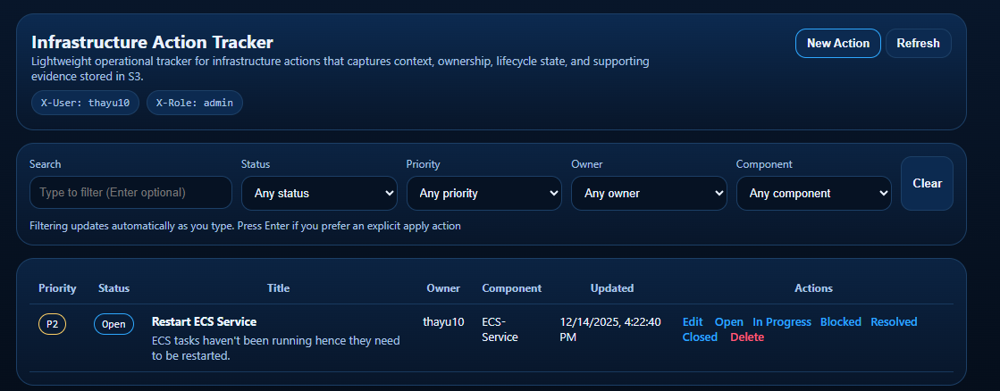
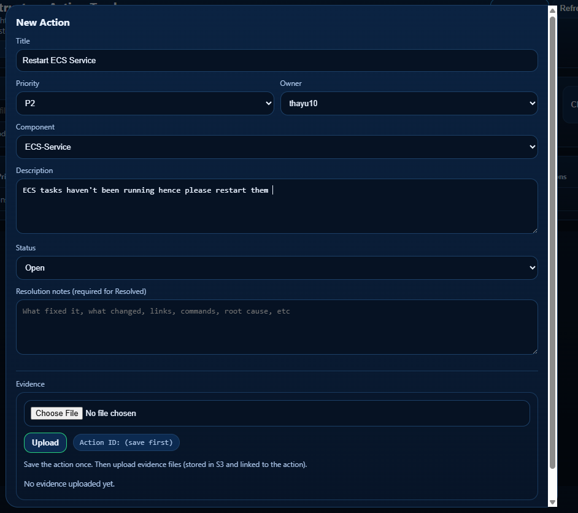
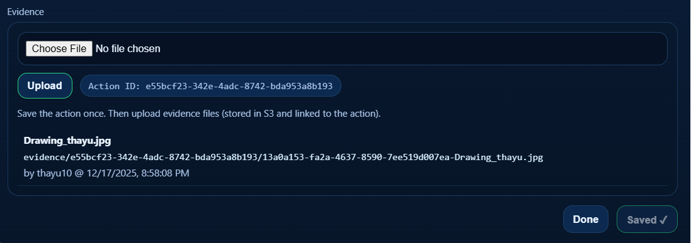

# 🛠️ Infrastructure Incident Management Tracking 
**Cloud-Native DevOps Incident Management System**

> **Tech Stack:** AWS ECS Fargate • Terraform IaC • Docker • PostgreSQL RDS • S3 • ALB • GitHub Actions CI/CD • Python Flask

Incident tracking application for cloud and DevOps teams to log operational issues, track lifecycle status, and store supporting evidence.

---

## 🚀 Cloud Architecture

### AWS Infrastructure
- **Compute:** ECS Fargate with auto-scaling orchestration
- **Networking:** Multi-AZ VPC with public/private subnets, NAT/Internet Gateways
- **Load Balancing:** ALB with health checks and target groups
- **Database:** RDS PostgreSQL with automated backups in private subnets
- **Storage:** S3 with AES256 encryption and lifecycle policies
- **Security:** IAM roles, security groups, OIDC authentication (no static credentials)
- **Monitoring:** CloudWatch Logs and metrics

### Infrastructure as Code
**Modularized Terraform with Remote Backend:**
- S3 bucket for state storage
- DynamoDB table for state locking
- Enables team collaboration and prevents concurrent modifications
```
├── VPC & Networking (subnets, routing, security groups)
├── ALB (listeners, target groups)
├── ECS (Fargate cluster, task definitions, services)
├── RDS (PostgreSQL with private access)
├── IAM (execution/task roles, OIDC for GitHub)
├── S3 (encrypted evidence storage)
├── CloudWatch (logging and monitoring)
└── Bastion (optional admin access)
```

---

## 🔄 CI/CD Pipeline

### Deployment Flow
**GitHub Actions → Docker Hub → AWS ECS**

1. Build Docker image with immutable SHA-based tags (`sha-<commit>`)
2. Push to Docker Hub
3. Terraform updates ECS task definition
4. ECS performs zero-downtime rolling deployment

### Infrastructure Management
- **Automated Provisioning:** Complete infrastructure via CI/CD
- **Manual Teardown Workflows:** Full resource destruction and backend cleanup for cost control
- **Security:** Network isolation (ECS in private subnets), encryption at rest/in transit

---

## 💼 Application Features

### Purpose
Lightweight tracking for infrastructure incidents, cloud migrations, operational follow-ups, and audit evidence.

### Core Capabilities
- Full lifecycle management (Open → In Progress → Blocked → Resolved → Closed)
- Role-based access control (member/lead/admin)
- S3-backed evidence attachments
- Real-time filtering and search
- Audit trail with status transitions

---

## 📸 Application Interface

### Main Dashboard

*Searchable action item list with real-time filtering, priority-based sorting, and quick status updates*

### Action Management

**Creating New Actions**  
  
*Modal-based form for creating infrastructure actions with priority, owner, and component assignment*

**Evidence Upload Integration**  
  
*S3-backed file attachment system for storing operational evidence and documentation*

---

## 🏗️ Architecture Flow

### Infrastructure Diagram

*Complete AWS infrastructure showing VPC, ECS Fargate, RDS, ALB, and S3 integration*

### Deployment Flow
```
GitHub Actions (OIDC)
    ↓
Docker Hub (immutable tags)
    ↓
Terraform Apply
    ↓
┌─────────────────────────────────────────┐
│  VPC (Multi-AZ)                         │
│  ┌────────────────────────────────────┐ │
│  │ Public Subnets                     │ │
│  │   └─ ALB (HTTP/80)                 │ │
│  └────────────────────────────────────┘ │
│  ┌────────────────────────────────────┐ │
│  │ Private Subnets                    │ │
│  │   ├─ ECS Fargate (Flask app)       │ │
│  │   └─ RDS PostgreSQL                │ │
│  └────────────────────────────────────┘ │
│  NAT Gateway → Internet Gateway         │
└─────────────────────────────────────────┘
         ↓
    S3 (Evidence Storage)
    CloudWatch (Logs & Metrics)
```

---

## 🎯 Key Capabilities

✅ **Fully Automated Deployment** - End-to-end Terraform and GitHub Actions pipeline  
✅ **Production-Ready Security** - OIDC authentication, network segmentation, encryption everywhere  
✅ **Enterprise Scalability** - Multi-AZ deployment with horizontal scaling support  
✅ **Cost Optimized** - On-demand infrastructure teardown for non-production environments  
✅ **Operational Excellence** - CloudWatch monitoring, automated backups, immutable deployments